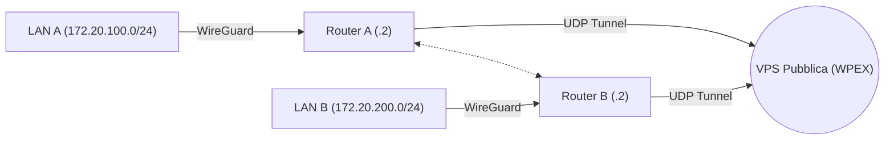

# 🌐 VPN Site-to-Site con NAT Traversal (WireGuard + WPEX)

Questo progetto realizza una connessione VPN sicura tra due sedi remote (LAN A e LAN B) entrambe dietro NAT (senza IP pubblico), utilizzando un **Relay Server centrale** e il protocollo **WireGuard**.

Il sistema utilizza **WPEX** (WireGuard Peer Exchange) per gestire il routing dei pacchetti attraverso il server pubblico.

## 🏗️ Architettura



## 📋 Prerequisiti

* **Server Cloud (VPS):** Accesso SSH, IP Pubblico, porta UDP 40000 aperta.
* **Client Locale:** Docker Desktop e Docker Compose installati.
* **WireGuard Tools:** Per la generazione delle chiavi (`wg genkey`).

## 🚀 Installazione e Configurazione

### 1. Lato Server (VPS Pubblica)

Il server agisce come relay trasparente. Non decifra il traffico, ma inoltra i pacchetti tra i peer autorizzati.

```bash
# Esempio di avvio con binario WPEX
./wpex --port 40000 \
  --allow "CHIAVE_PUBBLICA_A" \
  --allow "CHIAVE_PUBBLICA_B"

```

### 2. Lato Client (Simulazione Locale con Docker)

L'ambiente simula due router e due PC client su reti isolate (`172.20.x.x`) per evitare conflitti con la rete scolastica/domestica.

**Struttura file:**

```text
/lab-vpn
├── docker-compose.yml  # Definizione dell'infrastruttura
├── config_a/wg0.conf   # Config Router A
└── config_b/wg0.conf   # Config Router B

```

**Configurazione Chiave (`wg0.conf`):**
Ogni router deve puntare al server pubblico come `Endpoint` ma usare la chiave pubblica dell'altra sede come `Peer`.

* **Endpoint:** `IP_PUBBLICO_VPS:40000`
* **PersistentKeepalive:** `10` (Fondamentale per mantenere aperto il NAT).
* **AllowedIPs:** Include l'IP Tunnel remoto E la Subnet remota.

## ▶️ Avvio della Simulazione

Dalla cartella del progetto:

```bash
# 1. Avvia i container in background
docker-compose up -d

# 2. Verifica lo stato (devono essere tutti "Up")
docker ps

```

## 🧪 Test di Connettività

### Test 1: Ping Tunnel (Router-to-Router)

Verifica che i router comunichino attraverso il relay.

```bash
docker exec -it router-a ping 10.200.0.2

```

### Test 2: Ping LAN-to-LAN (Client-to-Client)

Verifica il routing completo dalla LAN A alla LAN B.

```bash
docker exec -it pc-a ping 172.20.200.10

```

## ⚠️ Risoluzione Problemi Comuni

* **Address already in use:** Docker va in conflitto con la rete locale. **Soluzione:** Usare le subnet `172.20.x.x` nel `docker-compose.yml` e fare `docker network prune`.
* **Timeout Ping:**
* Verificare che le chiavi pubbliche siano incrociate correttamente.
* Verificare che il Firewall della scuola/rete non blocchi la porta UDP 40000 in uscita.
* Controllare che `PersistentKeepalive` sia impostato.
